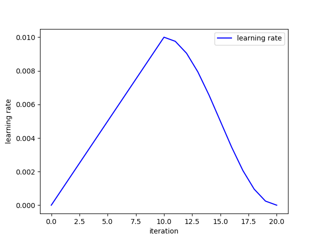

# PyTorch-Learning-Rate-WarmUp




## Implementation

```python
import torch
import matplotlib.pyplot as plt

class LearningRateWarmUP(object):
    def __init__(self, optimizer, warmup_iteration, target_lr, after_scheduler=None):
        self.optimizer = optimizer
        self.warmup_iteration = warmup_iteration
        self.target_lr = target_lr
        self.after_scheduler = after_scheduler

    def warmup_learning_rate(self, cur_iteration):
        warmup_lr = self.target_lr*float(cur_iteration)/float(self.warmup_iteration)
        for param_group in self.optimizer.param_groups:
            param_group['lr'] = warmup_lr

    def step(self, cur_iteration):
        if cur_iteration <= self.warmup_iteration:
            self.warmup_learning_rate(cur_iteration)
        else:
            self.after_scheduler.step(cur_iteration-self.warmup_iteration)

if __name__ == '__main__':
    v = torch.zeros(10)
    lr = 1e-2
    total_iter = 20
    warmup_iter = 10

    optim = torch.optim.SGD([v], lr=lr)
    scheduler_cosine = torch.optim.lr_scheduler.CosineAnnealingLR(optim, total_iter-warmup_iter)
    scheduler = LearningRateWarmUP(optimizer=optim,
                                   warmup_iteration=warmup_iter,
                                   target_lr=lr,
                                   after_scheduler=scheduler_cosine)

    x_iter = [0]
    y_lr = [0.]

    for iter in range(1, total_iter+1):
        scheduler.step(iter)
        print("iter: ", iter, " ,lr: ", optim.param_groups[0]['lr'])

        optim.zero_grad()
        optim.step()

        x_iter.append(iter)
        y_lr.append(optim.param_groups[0]['lr'])

    plt.plot(x_iter, y_lr, 'b')
    plt.legend(['learning rate'])
    plt.xlabel('iteration')
    plt.ylabel('learning rate')
    plt.show()

```

## Results

```
iter:  1  ,lr:  0.001
iter:  2  ,lr:  0.002
iter:  3  ,lr:  0.003
iter:  4  ,lr:  0.004
iter:  5  ,lr:  0.005
iter:  6  ,lr:  0.006
iter:  7  ,lr:  0.007000000000000001
iter:  8  ,lr:  0.008
iter:  9  ,lr:  0.009
iter:  10  ,lr:  0.01
iter:  11  ,lr:  0.009755282581475769
iter:  12  ,lr:  0.009045084971874737
iter:  13  ,lr:  0.007938926261462366
iter:  14  ,lr:  0.006545084971874737
iter:  15  ,lr:  0.005
iter:  16  ,lr:  0.003454915028125263
iter:  17  ,lr:  0.0020610737385376348
iter:  18  ,lr:  0.0009549150281252633
iter:  19  ,lr:  0.00024471741852423234
iter:  20  ,lr:  0.0
```
